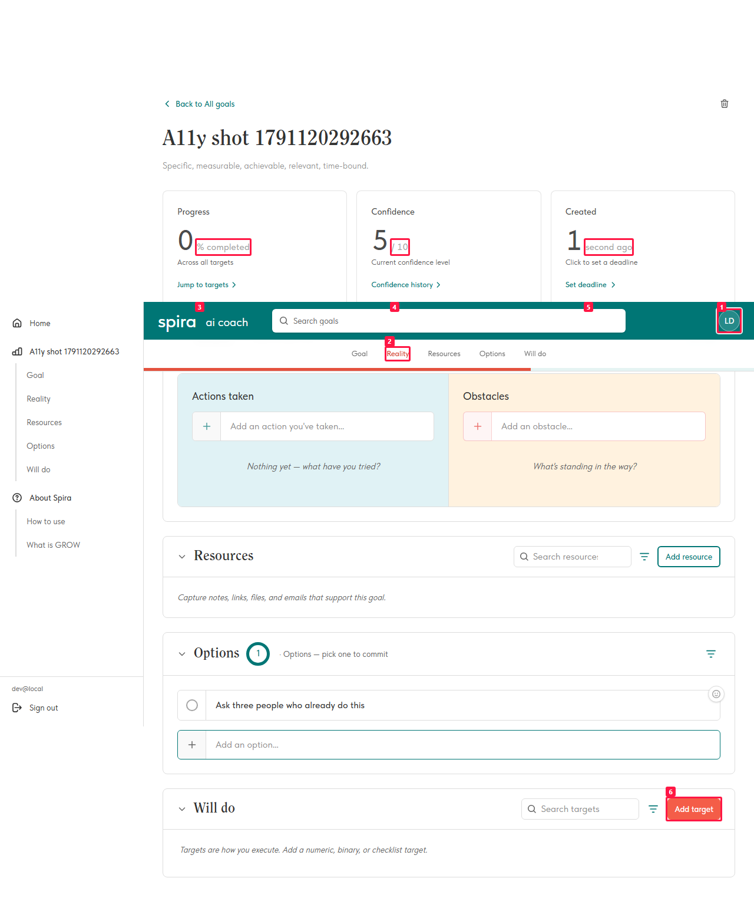
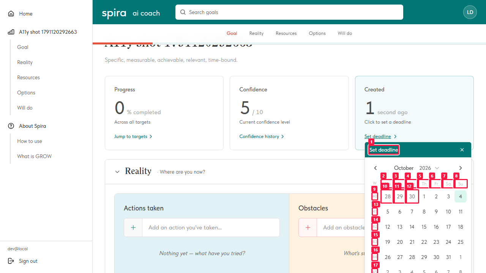
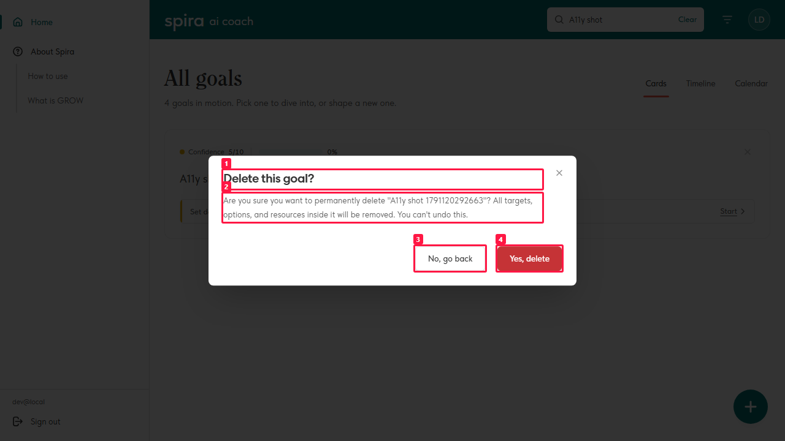
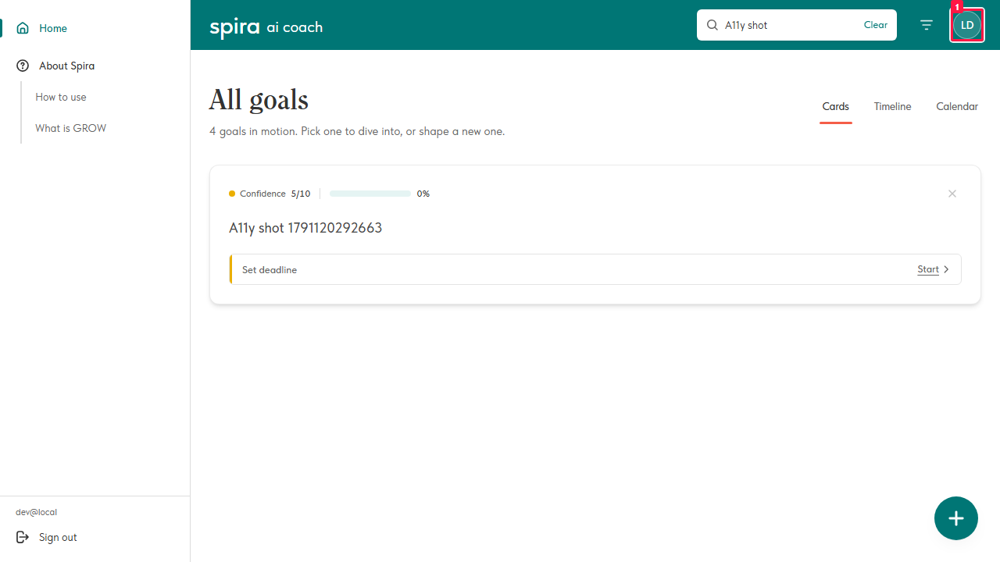
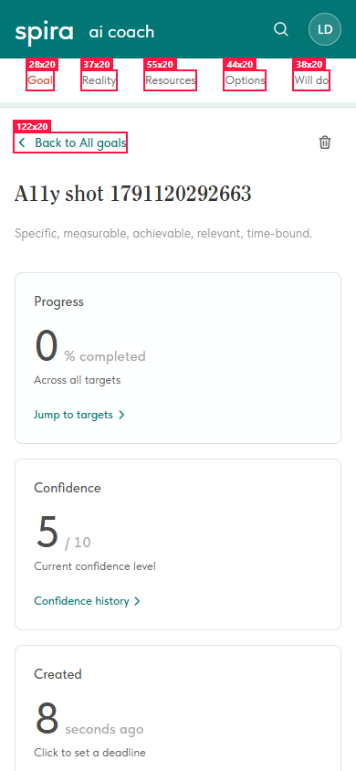
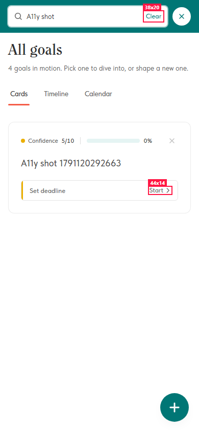
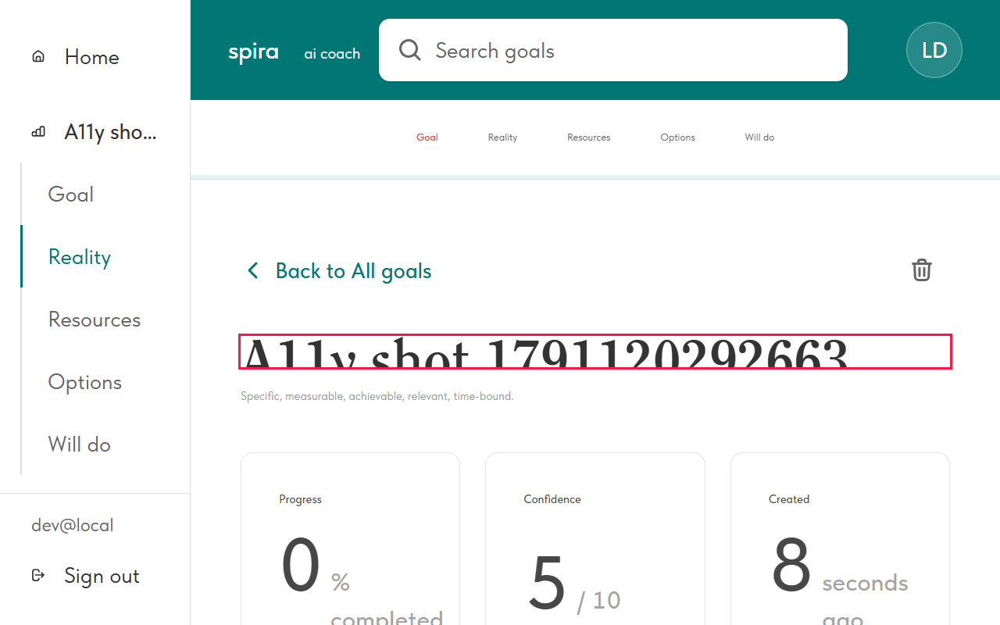

# Contrast, tap targets and text resizing fail WCAG in named places

- **ID:** BUG-096
- **Status:** 🐞 Open
- **Reported by:** The automated accessibility checks (BUG-023), 2026-10-04
- **Area:** Web frontend — the palette, and three components
- **Severity:** Medium — nothing is unusable, but the failures are on the app's own chrome and on a
  primary action, so they are on every screen rather than in a corner

## Summary

Everything here was **measured, not judged**: `e2e/accessibility.spec.ts` and `a11y-overlays.spec.ts` (axe over **37 surfaces**),
`e2e/a11y-target-size.spec.ts`, `e2e/a11y-zoom.spec.ts` and `e2e/a11y-keyboard.spec.ts`. Each
finding is recorded in those specs' baselines, so none of them can get worse without a red build —
and none of them goes away until it is fixed here.

**They are mostly four decisions, not forty mistakes.** One pair of colours is on the app's
header; one muted grey is used for every secondary label; one button uses the brand coral behind
white text; one row of controls is a line of text with no padding. Fixing those four removes most
of the table below.

The pictures are in [`images/a11y/`](./images/a11y). Each red box is a node the scanner named, and
every one was photographed against a goal the test created — no real content appears in them.

---

## 1. Contrast — WCAG 1.4.3 (AA), 4.5:1 for body text

| # | What | Measured | Where |
|---|---|---|---|
| 1 | **The account avatar** — white initials on `bg-white/15` over Kale | **4.08:1** | the header, so **every screen in the app** |
| 2 | **The active section-nav item** on a goal — `reserved-800 #D34533` | **4.4979:1** | misses by two thousandths |
| 3 | **`text-muted-foreground/60` `#A3A3A3` on white** — "% completed", "/ 10", "days ago" | **2.52:1** | the goal page's three cards |
| 4 | **"Add target" — white on Guava `#F45D48`** | ≈**3:1** | the Will-do section's primary action |
| 5 | **The date card**: its own "Set deadline" (white on Kale), **the weekday headings Mo–Su**, the ISO week numbers at `/40`, the greyed days of the neighbouring month | 17 nodes | every deadline anywhere |
| 6 | **The delete confirm**: heading, description and both buttons | 4 nodes | every confirm |
| 7 | **A ⋯ menu's destructive item** — "Delete option", red on white | 1 node | every element menu |

*The goal page: 1 — the avatar · 2 — the active nav item in `#D34533` · 3–5 — the muted labels ·
6 — the "Add target" button (below the fold in this crop).*

*The date card is the densest single surface: its own teal head, then **every weekday heading**,
then the week numbers and the greyed-out days.*

**Fix approach.** All of it is palette, which makes it the owner's call rather than a code change
anyone can make alone:

- the avatar and "Set deadline" are the **white-on-Kale** pair: either a darker teal behind white
  text (`brand-900 #007777` gives 5.1:1) or dark text on the light fill;
- `text-muted-foreground/60` is **two steps too light** — `neutral-1200 #6B6B6B` reaches 5.3:1 at
  the same size;
- Guava behind white is ≈3:1 whatever the size — either dark text on Guava, or `reserved-900
  #C23928` behind white (5.4:1), which is what the section nav already moved to;
- the nav's `#D34533` misses by 0.0021, so only the next step down the ramp passes. The owner has
  already said 900 reads red rather than coral; the alternative is 14px **bold**, where the
  threshold drops to 3:1 — but see BUG-023 on why a weight change renders identically in this
  font.

---

## 2. Tap targets — WCAG 2.2 AA (2.5.8), 24×24

> **Level, precisely:** target size is **AAA** in WCAG 2.1 (2.5.5, 44×44) and only became **AA** in
> WCAG 2.2 (2.5.8, 24×24). The suite fails on the 24px floor and merely reports the 44px one, so a
> green run still means what it says.

| What | Measured |
|---|---|
| **"Start"** on every goal card | **44×14** |
| **"Clear"** inside the search field | **38×20** |
| The goal page's whole section nav — Goal · Reality · Resources · Options · Will do | **28×20 … 55×20** |
| **"Back to All goals"** | **122×20** |
| **"Coach"** | **57×20** |

**Every one of them is 20px or less tall for the same reason: the line of text *is* the target.**
None has vertical padding of its own. The fix is the same everywhere — give the control a minimum
height (or `py-1`) rather than enlarging the type.

A further **100 targets are under 44×44**, the 2.1 AAA figure; the full list is attached to each
run of `a11y-target-size.spec.ts` as `targets-under-44px.txt`. That number is information, not a
failure.

---

## 3. Text at 200 % — WCAG 1.4.4 (AA)

The goal description's auto-sizing `textarea` shows **79px of text in a 40px box** and hides the
rest, with no scrollbar to reach it. Its height is written in pixels from one measurement of the
content, and nothing measures again when the font grows — which is exactly the failure 1.4.4
describes. Everything else on the page reflows.

**Fix approach:** re-run the autosize when the text metrics change, not only when the value does —
a `ResizeObserver` on the field, or re-measuring on `document.fonts` changes and on the first
layout after a style change.

---

## Already fixed, in the same pass (here so nobody re-reports them)

| | |
|---|---|
| The Calendar page's month ‹ › arrows had **no accessible name** | named |
| The date card's **year combobox** had none either | `aria-label="Year"` |
| The **AI providers sheet's close X** had none — the only way out announced itself as "button" | named |
| An image **could not be opened at all with a keyboard** (a `
`) | a real `<button>` |
| Four overlays closed **only** on a backdrop click | Escape added |
| **Every** sheet and dialog dropped focus on `<body>` when closed — Radix restores only to a `Trigger`, and nothing here uses one | `src/components/ui/restore-focus.ts` |
| **15 form labels** were bound to nothing | `useId()` + `htmlFor` |
| The sign-in screen had **two links that went nowhere** | plain words until the pages exist |
| A `role="textbox"` with no `tabIndex` | stated explicitly |
| The **date control on a target card** had no accessible name — its trigger is drawn by the caller, which drew no text | named by the component, which knows the date |

## Noted, deliberately not fixed

- **`aria-hidden-focus` behind an open menu.** Radix marks the page `aria-hidden` while leaving its
  links in the tab order — here the left `<aside>`. Focus is trapped inside the menu, so nothing is
  actually reachable; the remedy is a Radix-level decision (`modal={false}` on every menu, giving up
  the scroll lock), not a markup fix.
- **The resource's "Remove" button is named only by its `title`.** It computes a name, so no rule
  fires, but `title` is the weakest way to name a control — it is invisible to touch and
  inconsistent across screen readers. Worth an `aria-label` next time that file is open.

## How to verify fixed

1. Fix one thing, then **lower its number** in the matching baseline — `ACCEPTED` in
   `accessibility.spec.ts` / `a11y-overlays.spec.ts`, `SMALLER_THAN_AA` in
   `a11y-target-size.spec.ts`, `ALLOWED_CLIPPED` in `a11y-zoom.spec.ts` — and re-run. The suite
   fails if a surface has *more* than it is admitted to have, so a fix that is not recorded simply
   leaves the check looser than it could be.
2. The avatar alone takes a node off nearly every surface in the table; expect most of the
   `color-contrast` numbers to drop at once.
3. `npx playwright test e2e/accessibility.spec.ts e2e/a11y-overlays.spec.ts e2e/a11y-target-size.spec.ts e2e/a11y-zoom.spec.ts e2e/a11y-keyboard.spec.ts`

## Resolution

_(empty — open)_
