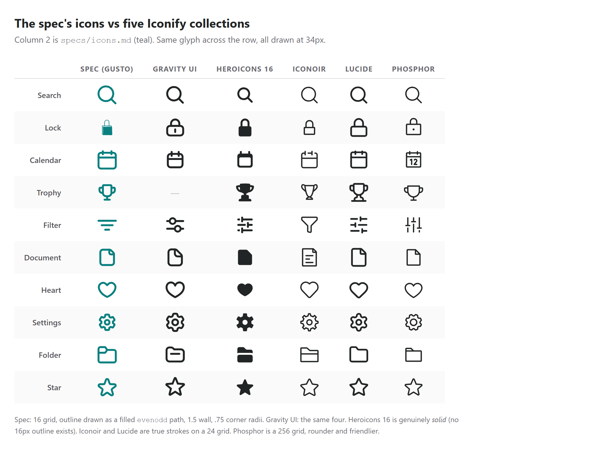
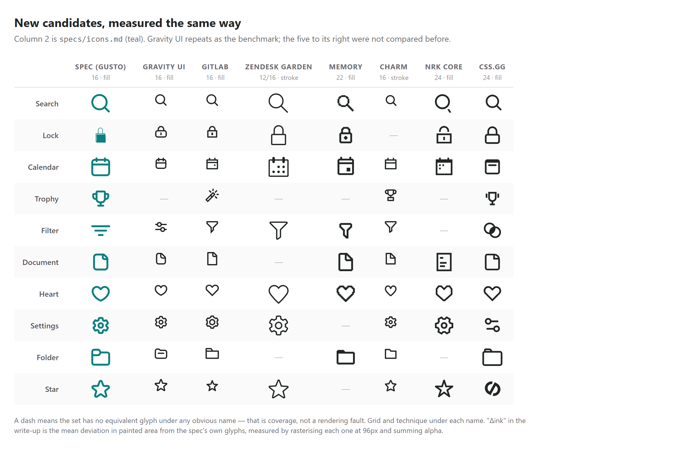
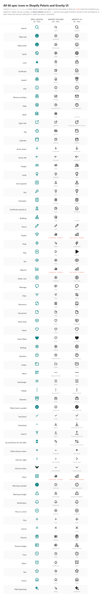
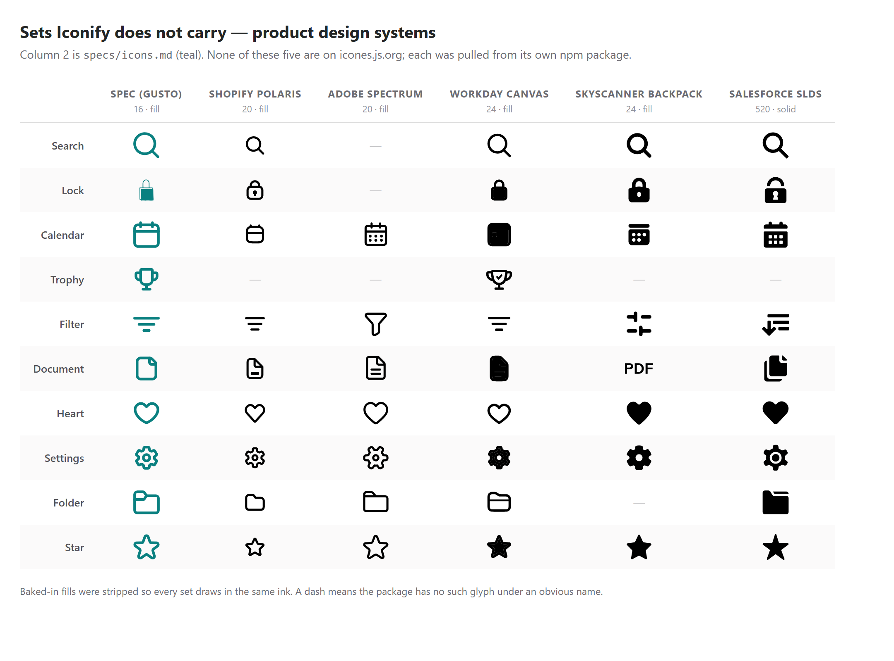

# Icon sets — the shortlist

A comparison of the free icon sets Spira could standardise on.

> **Decided (2026-08-14): both surfaces are on Gravity UI, every glyph.** The owner chose it from
> this comparison and picked the substitutes for the marks Gravity does not have. Android
> (`ui/icons/SpiraIcons.kt`, one `gravity()` builder) and the web (`src/components/spira/icons.tsx`,
> one `make()` factory) are both done; `lucide-react` and the hand-drawn `brand-icons.tsx` are gone.
>
> The rest of this file is kept as the reasoning behind that choice, not as an open question.

Related: `specs/icons.md` (the owner's reference collection) and
CLAUDE.md → Design → Components and chrome → "Icons & emoji" (which set each surface actually uses today).

---

## Where the numbers come from

Every count below was measured on **2026-08-11** by walking each repository's git tree and
counting `.svg` blobs per style folder — not taken from marketing copy. Vendors usually publish
the *total across styles*, which inflates a set by 2–6×. The column that matters when you are
picking a visual language is **unique glyphs**: how many different things the set can say.

Phosphor is the honest case: it advertises ~1,500 and it really does have 1,512 *unique* icons —
they just also ship 9,072 files, because each icon exists in six weights.

---

## The comparison

| Set | **Unique glyphs** | Styles / weights | Total files | Grid | Stroke | Licence |
|---|---|---|---|---|---|---|
| **Tabler** | **5 130** | outline + filled (1 054 of them) | 6 184 | 24×24 | 2 | MIT |
| **Gravity UI** | **730** | outline + 69 `-fill` twins | 799 | 16×16 | 1.5 (as a fill) | MIT |
| **Lucide** | 1 768 (+356 experimental in `lab/`) | one | 1 768 | 24×24 | 2 | ISC |
| **Remix** | 1 516 | line + fill (1 376 pairs) + 140 logos | 2 892 | 24×24 | filled | Apache 2.0 |
| **Phosphor** | 1 512 | **6** — thin, light, regular, bold, fill, duotone | 9 072 | 256×256 | 16 | MIT |
| **Bootstrap Icons** | 1 409 | 670 have a `-fill` twin | 2 078 | 16×16 | filled | MIT |
| **Iconoir** | 1 383 | regular + solid (288 of them) | 1 671 | 24×24 | 1.5 | MIT |
| **Heroicons** | 324 | 4 — 24 outline, 24 solid, 20 solid, 16 solid | 1 288 | 24 / 20 / 16 | 1.5 | MIT |

Three things the table doesn't show, all verified:

- **Tabler's `filled` is a strict subset of `outline`** — every filled name also exists as an
  outline, so 5 130 really is the ceiling, not 5 130 + 1 054.
- **Heroicons' 16×16 "micro" set (316) is a subset of the 324** — there are no micro-only icons.
- **Remix's line and fill are perfectly paired** (1 376 each); the remaining 140 are brand logos,
  which are not really part of the UI language.

---

## How each one reads next to the design Spira was modelled on

Spira's look was learned from the **reference collection** in `specs/icons.md`. Those icons are drawn
on a **16 grid with a 1.5 stroke, fully rounded terminals, exported as filled paths** — the
signature is a `.75` corner radius (half the stroke) and the constant `1.06` (the stroke's
diagonal) appearing all over the path data.

| Set | Match to that drawing system |
|---|---|
| **Gravity UI** (Yandex) | **The closest match, and the only exact one.** All four signatures agree: 16 grid, a **1.5 wall**, `.75` radii, the `1.06` diagonal, and the same `fill-rule="evenodd"` outline-drawn-as-a-fill. Unlike Heroicons it is **outline throughout**, which is what the reference set actually is — and its 69 `-fill` twins give the filled/selected state Iconoir cannot. Verified glyph by glyph, not by eye: see the sheet below. |
| **Heroicons** | **Same technique, wrong style.** Its 16px set is **solid**, not outline — Heroicons ships 24-outline, 24-solid, 20-solid and 16-solid, and **there is no 16px outline at all**. The magnifying glass matches the reference construction exactly (1.5 ring, `.75`, `1.06`) only because a magnifier is inherently a ring; `document-16-solid` and `folder-16-solid` are plain filled shapes. An earlier version of this file called it "effectively identical" on the strength of that one glyph — that was wrong, and the comparison sheet below is why. |
| **Iconoir** | Close in feel, different technique: a true **stroke** at 1.5 on a 24 grid. Lighter and more delicate than the reference set; a real outline rather than an outline-shaped fill. |
| **Lucide** | Geometric and slightly heavier (2 on 24 ≈ 0.083 vs the reference set's 0.094 — the closest *weight* ratio of the mainstream stroke sets), but plainer in personality. |
| **Phosphor** | The friendliest and roundest — closest to the reference set's *illustrative* icons (Pig, Trophy, Lamp). Six weights include a Fill, which is what a filled/selected state wants. |
| **Tabler** | Breadth champion; visually neutral-geometric, close to Lucide. |
| **Remix** | Deliberately neutral — designed to disappear rather than have a personality. |
| **Bootstrap** | 16 grid like the reference set, but a heavier, blunter house style. |

### Seen side by side (2026-08-13)

The claims above were checked by pulling the real path data from the Iconify API
(`api.iconify.design/<prefix>.json?icons=…`) and rendering the same ten glyphs from
`specs/icons.md` next to five collections. What the picture shows, and no table can:

- **Gravity UI** sits on top of the spec's drawing for Search, Calendar, Heart, Settings and Star —
  same weight, same corner rounding, same optical size in the box.
- **Heroicons 16** is solid black for Document, Heart, Folder and Star. It is a *filled* set.
- **Iconoir** and **Lucide** are visibly lighter: a true stroke at 1.5/24 and 2/24 against the
  spec's 1.5/16, which is a third to a half more ink per unit of size.
- **Phosphor** is rounder and friendlier than any of them — closest to the collection's
  *illustrative* glyphs (Pig, Trophy, Lamp), furthest from its UI ones.

Gravity UI's gaps against the collection are real but narrow: no `trophy` (it has `cup` and
`medal`), no `pig`, `bank`, `building` or `certificate` — all four of which are *payroll*
metaphors that Spira does not use. At **730 unique glyphs** it is the smallest set on this
shortlist by a wide margin, which is the honest argument against it: `SpiraIcons.kt` already
declares **94**, and a set that runs out is a set that gets mixed with a second one.

### The second sweep — all 111 collections, measured (2026-08-13)

The sets above were a shortlist someone chose. This pass asked the opposite question: **of every
general-purpose collection Iconify serves, which ones are drawn like `specs/icons.md`?** All 111
collections in Iconify's `UI 16px / 32px`, `UI Other / Mixed Grid` and `UI 24px` categories were
probed for the same five glyphs (search, folder, heart, calendar, star) and scored on two things:

- **The drawing signature** — 16 grid, filled rather than stroked, `fill-rule="evenodd"`, and the
  two constants that give the reference drawing away: `.75` (half the 1.5 stroke) and `1.06` (its
  diagonal).
- **Δink** — how much *painted area* each glyph has against the spec's own, measured by
  rasterising both at 96px and summing alpha. This is the number that says "same weight" without
  anyone squinting.

| Set | Δink | Grid | Technique | Glyphs | Licence |
|---|---|---|---|---|---|
| **Gravity UI** | **7 %** | 16 | fill, 100 % evenodd, `1.06`×5 | 799 | MIT |
| **Octicons** (GitHub) | 8 % | 16 | fill, no evenodd | 743 | MIT |
| **Zendesk Garden** | 9 % | 12 / 16 | **stroke** | 932 | Apache 2.0 |
| **GitLab** (`pajamas`) | **10 %** | 16 | fill, 80 % evenodd, `1.06`×6 | 410 | MIT |
| **Memory** | 10 % | 22 | fill | 651 | Apache 2.0 |
| **Charm** | 10 % | 16 | stroke | 261 | MIT |
| **NRK Core** | 12 % | 24 | fill, 100 % evenodd | 637 | CC BY 4.0 |
| **css.gg** | 14 % | 24 | fill, 80 % evenodd | 704 | MIT |

**GitLab's `pajamas` is the only new set that really competes with Gravity UI** — same 16 grid,
same filled-evenodd technique, the same `1.06` constant, MIT. It is also the smallest serious
option at 410 glyphs, and it is a *product* set: it spends its budget on merge requests, pipelines
and issue types rather than on a trophy or a piggy bank (the sheet's Trophy column shows the
closest thing it has, a magic wand).

**Memory is the cautionary tale, and the reason this file keeps rendering pictures.** It scores a
10 % Δink — third best of 111 — and it is an **8-bit pixel-art set**. The number was never wrong;
it just cannot see that the glyphs are made of squares. No metric replaces looking.

Two more that the numbers flatter and the picture does not: **Zendesk Garden** draws much larger
in its box (a 12 unit grid), and **css.gg** has weak semantic coverage — its `stark` is not a star
and it has no gear.

### All 66, three ways (2026-08-14)

The two finalists against **every** icon in `specs/icons.md`, with the real name each set gives the
glyph underneath it — so the question stops being "does it look similar" and becomes "does it
actually have the thing, and what is it called there".

- **Neither set has a trophy.** The owner's rule for that case is **chart-column** as the stand-in,
  which is what the sheet shows (in coral), and it therefore answers Chart and Reports too. Gravity
  does have `cup` and `medal` if a cup is wanted later; Polaris has neither.
- **Gravity has no `bank` and no `building`** under any name — a real gap, shown as a dash rather
  than papered over with a near-miss.
- Some matches are honest approximations rather than the same drawing: Pig → `Money` / `wallet`,
  Certificate → `Note` / `file-check`, Flash → Polaris `Magic` (it has no bolt; Gravity has
  `thunderbolt`). Those are the rows to look at hardest, because they are where a switch would
  actually change what an icon *says*.

### Beyond Iconify — product design systems (2026-08-13)

Everything above lives in Iconify's catalogue, which is what icones.js.org browses. The sets a
*product* draws for itself are mostly **not** there, and those are the ones built for exactly this
job: a small vocabulary, one grid, one weight. Each was pulled from its own npm package rather
than from any aggregator, and measured identically.

| Set | Δink | Grid | Technique | Glyphs | Licence | Source |
|---|---|---|---|---|---|---|
| **Shopify Polaris** | 36 % | 20 | fill, evenodd, `.75` + `1.06` | 534 | MIT | `@shopify/polaris-icons/dist/svg/` |
| **Adobe Spectrum** | **16 %** | 20 | fill | 396 | Apache 2.0 | `@adobe/spectrum-css-workflow-icons/dist/assets/svg/` |
| **Workday Canvas** | 39 % | 24 | fill | 1 091 | Apache 2.0 | `@workday/canvas-system-icons-web/dist/svg/` |
| **Skyscanner Backpack** | 53 % | 24 | fill, heavy (3/24) | 292 | Apache 2.0 | `@skyscanner/bpk-svgs/dist/svgs/icons/sm/` |
| **Salesforce SLDS** | 70 % | 520 | solid | 787 | BSD 3-Clause | `@salesforce-ux/design-system/assets/icons/utility/` |

> **Polaris has no gallery any more.** `polaris-icons.shopify.com` and `polaris.shopify.com/icons`
> both 301 to `shopify.dev/docs/api/polaris`, which has no icon explorer — the npm package and the
> GitHub repo are the only sources. So all 534 are rendered here instead:
> **`specs/icon-set-polaris-all.png`**, pulled from `@shopify/polaris-icons` and drawn at one size.

**Shopify Polaris is the drawing system's twin, one grid larger.** Its search glyph is built the
same way as the reference set's — `a5.5 5.5 0 1 1 1.06-1.06 … a.75.75 0 1 1-1.06 1.06`, a 1.5-unit ring
with `.75` caps — and its **Filter is the spec's Filter**, the same three descending lines rather
than everyone else's funnel or sliders. The difference is the box: 1.5 on a **20** grid is 0.075
of the render size against the reference set's 0.094, so it reads about a fifth lighter. That is the whole
of its 36 % Δink, and it is a *correctable* difference — unlike a set drawn in a different
language.

Adobe Spectrum wins on ink (16 %) but not on character: it is a tool-palette set, denser and more
technical, and it has no search or lock in the workflow package at all. Workday is a
1 091-glyph enterprise vocabulary with a real trophy, but heavier and squarer. Backpack is
deliberately chunky (a 3-unit wall on 24). SLDS is solid, and a different thing entirely.

**Nothing here beats Gravity UI on the drawing system, and Polaris is the only set on this page
that would need a decision rather than a rewrite** — take it and everything is a fifth lighter, or
scale it 16/20 and it is the reference drawing with a different vocabulary.

Checked and **not** available this way: Atlassian (`@atlaskit/icon`), Twilio Paste, VTEX Shoreline
and Kiwi Orbit all ship React components with no SVG files in the package, so none can be measured
or ported without running their build.

### Coverage of the 66 icons Spira actually references

Measured by matching all 66 names in `specs/icons.md` against each set's full file list:

- **Heroicons — 65 / 66.** Only *Pig* has no equivalent (and Spira does not use it).
- **Phosphor — all 66**, including `piggy-bank`.
- **Iconoir — 85 / 87** of the Android icon names; no `target` and no `unlink` (substituted with
  `dash-flag` and `link-slash`).

---

## What each would cost this repo

Both surfaces hand-port path data — the web into React components, Android into
`ui/icons/SpiraIcons.kt`. So the practical questions are the grid and whether the set is stroked
or filled.

| Set | Android | Web |
|---|---|---|
| **Gravity UI** | 16×16 `evenodd` filled paths — **this is what shipped**; the `gravity()` builder in `SpiraIcons.kt` takes them unchanged | `npm i @gravity-ui/icons`, or hand-port; Iconify serves it as `gravity-ui:*` |
| **Heroicons** | 16×16 filled paths drop into a filled builder unchanged | `npm i @heroicons/react`, import from `@heroicons/react/16/solid` |
| **Iconoir** | 24×24 stroke 1.5 — what `SpiraIcons.kt` used before the move | `iconoir-react`, or hand-port |
| **Lucide** | 24×24 stroke 2 | already installed (`lucide-react`) |
| **Phosphor** | 256×256 — fine, just a different viewport, but the numbers stop being readable | `@phosphor-icons/react` |
| **Tabler** | 24×24 stroke 2 | `@tabler/icons-react` |

Two traps that apply to **every** set when porting to Compose, both already learned here:

1. **One argument per source `<path>`.** Merging an icon's paths changes how overlaps fill and can
   hollow the glyph out.
2. **Space the arc flags.** Compose's parser rejects SVG's compact `a.75.75 0 011.06-1.06`.

A mis-transcribed path draws **nothing** while every existence assertion stays green — so always
re-render a `VisualCheck*` test and look at the PNG.

---

## Where things stand right now

- **Android** — ported wholesale to **Iconoir** (2026-08-11) so the owner can see it on a device.
  All 87 glyphs, drawn at a **2.0** stroke rather than Iconoir's native 1.5. Four marks are
  **Phosphor** fills instead — the trophy, the link and the two padlocks — because an outline is
  hard to read at 16–18dp for those shapes. Both sets are MIT.
  - Iconoir's solid set covers only 288 of its 1 383 icons, so a "filled when selected" state is
    not generally available: the footer's selected item falls back to a grey disc behind the same
    outline glyph.
- **Web** — still **Lucide**, plus four glyphs in `src/components/spira/brand-icons.tsx` traced
  from the reference collection (the two rating faces and the kebab in both orientations).

So the two surfaces are **not** on the same set at the moment. That is deliberate and temporary:
it is what makes the sets comparable side by side. Whichever set wins, both surfaces should move
to it together.

---

## Sources

- Tabler — https://tabler.io/icons · https://github.com/tabler/tabler-icons
- Lucide — https://lucide.dev · https://github.com/lucide-icons/lucide
- Remix — https://remixicon.com · https://github.com/Remix-Design/RemixIcon
- Phosphor — https://phosphoricons.com · https://github.com/phosphor-icons/core
- Bootstrap Icons — https://icons.getbootstrap.com · https://github.com/twbs/icons
- Iconoir — https://iconoir.com · https://github.com/iconoir-icons/iconoir
- Heroicons — https://heroicons.com · https://github.com/tailwindlabs/heroicons
- Gravity UI Icons — https://gravity-ui.com/icons · https://github.com/gravity-ui/icons
- Browsing / measuring across sets — https://icones.js.org, backed by the Iconify API
  (`https://api.iconify.design/collections`, `…/<prefix>.json?icons=a,b,c`)
